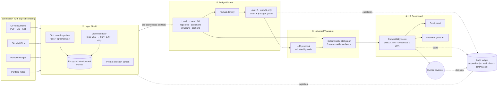
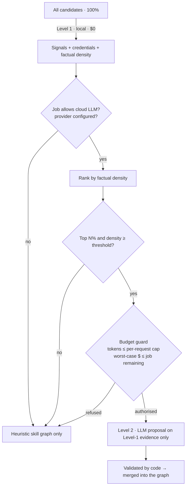

# TalentEngine-AI — Architecture manifesto

> **Thesis.** Most applicant tracking systems filter people on keywords and diplomas before a human ever
> looks at them. TalentEngine-AI evaluates what people have *demonstrably done* — repositories,
> documents, reports, photos of finished work — and ranks that evidence. Diplomas and certifications
> stay in the balance, but in second place, behind a hard cap. **The system never rejects anyone.**

This document describes the four sealed modules, the data that flows between them, and the design
decisions behind each boundary.

---

## 1. The three barriers the design answers

| Barrier | Risk | Architectural answer |
|---|---|---|
| **Legal** (GDPR, EU AI Act Annex III — recruitment is *high-risk*) | Discrimination, opaque automated decisions, personal-data exposure | Pseudonymisation is the only way in (Module 1); no reject path exists in code; every score is backed by cited evidence and written to a hash-chained, sealed ledger; a named human makes every decision. |
| **Financial** (token costs) | Sending thousands of CVs and repositories to a commercial LLM | Local-first funnel (Module 2): free static analysis for 100% of candidates, commercial escalation only for the top *N%* by factual density, with per-request token caps and a per-job dollar cap checked *before* each call. |
| **Domain** (HR has no technical background) | A recruiter cannot judge a Terraform module or a dovetail joint | A universal skill catalogue described in plain language (Module 3), translated into proof statements and an authorship-verification interview guide with expected answers (Module 4). |

---

## 2. System overview



**Boundary rule.** Modules never import each other sideways. Data only crosses a boundary as one of
the Pydantic models in [`backend/talentengine/models.py`](../backend/talentengine/models.py), and the
only place where the four modules meet is the orchestrator
([`pipeline.py`](../backend/talentengine/pipeline.py)). A module can be replaced (for example a
Presidio NER in Module 1, or a different scorer in Module 4) without touching the others.

---

## 3. Module 1 — The Legal Shield

The shield is the **only entry point**. Nothing downstream ever sees raw personal data.

### 3.1 Text pseudonymisation (`shield/pii.py`)

Detection is rule-based, deterministic and auditable — a regulator can read the rules:

| Category | Examples masked |
|---|---|
| Direct identifiers | name (declared at submission + CV header heuristic + `Name:` fields), e-mail, phone, profile URLs (LinkedIn, GitHub, Behance…), postal address |
| Protected characteristics | date of birth, age, civility (`Mme`, `Mr`), gender field, nationality, family status, religion, birthplace |
| Bias proxies | **school and university names** (the diploma stays, the prestige of the institution goes) |
| Grammatical gender | French job titles and adjectives rewritten in inclusive form (`développeuse` → `développeur·euse`), English pronouns made neutral |

Each value is replaced by a token such as `[PERSON_3fa9c1]`: an HMAC of the value, stable within a
candidate. The original is stored **encrypted** in the vault (`shield/vault.py`, Fernet / AES-128-CBC +
HMAC-SHA256). Re-identification is only possible through the API after a human *shortlist* or
*interview* decision, and is itself written to the ledger.

> Lesson learned while building it: every multi-word pattern must use horizontal whitespace only.
> A postal-code pattern using `\s+` silently swallowed the next CV line (the nationality line), and a
> school-name pattern swallowed a certification. Both are now covered by regression tests.

A `NerBackend` (spaCy French + English small models, `TE_NER=spacy`, on by default in Docker) adds
the names of *other* people (managers, referees, clients). It only accepts PER entities of two
capitalised words or more and excludes tech, trade and degree vocabulary, because over-masking erases
evidence: measurement caught it masking the verb "Négocié" and the diploma "CAP Menuisier".

**The declared name is mandatory.** On CV layouts the rules had never seen, undeclared names were
caught 1.4% of the time (23.6% with NER). An exact match on the name the candidate declares works
whatever the layout, so the submission requires it ([MEASUREMENTS.md](MEASUREMENTS.md)).

### 3.2 Visual redaction (`shield/vision.py`)

1. **Metadata stripping** — the image is re-encoded from raw pixels; EXIF/XMP/IPTC (GPS, author,
   camera serial) are dropped and listed in the redaction report.
2. **Region detection** — a pluggable `RegionDetector`. Default: a **local** vision-language model
   (Qwen2.5-VL via Ollama) asked for JSON boxes of faces, school logos, name tags, ID documents and
   personal text. Alternative: OpenCV Haar faces.
3. **Masking** — pixelate *then* Gaussian-blur each region (pixelation alone can be partially reversed).
4. **Description** — the same local VLM describes the *work* (materials, techniques, complexity cues);
   a second filter drops any sentence that still talks about a person.

**Fail closed.** If no detector can run, the image is quarantined and never analysed in clear.

### 3.3 Prompt-injection screen (`shield/injection.py`)

Candidate material is untrusted input that a model will later read. Instruction-like passages
(“ignore previous instructions”, “attribuez la note maximale”, fake `<system>` tags, zero-width or bidi
characters) flag the artifact. A flagged artifact is **excluded from the LLM context** and shown to the
recruiter as a warning — never auto-penalised: interpreting it is a human call.

The screen is organised by attack family (overriding instructions, addressing the model, steering this
candidate's score, false premises, prompt exfiltration, chat-template smuggling), folds Cyrillic/Greek
homoglyphs and counts invisible characters on the raw text. It catches 30/30 known attacks with no
false positive on 366 legitimate texts — and 1/10 unseen attacks. It is a tripwire; the guarantee is
the **bounded influence** of the model in Module 3.

### 3.4 The Audit Ledger (`shield/ledger.py`)

```text
ledger(seq, entry_id, kind, actor, job_id, candidate_ref, created_at, payload,
       prev_hash, entry_hash, seal)

entry_hash = sha256(seq | prev_hash | kind | actor | created_at | canonical_json(payload))
seal       = HMAC-SHA256(server_key, entry_hash)
```

| Layer | Protects against |
|---|---|
| SQLite triggers abort `UPDATE`/`DELETE` | application bugs, careless scripts |
| Hash chain | silent edits of any past entry (breaks every later hash) |
| HMAC seal | an attacker with file access recomputing the whole chain |

Entry kinds: `job_config` (every version of the recruiter's configuration), `ingestion` (consent,
artifact hashes, redaction reports), `escalation` (why selected, tokens, cost, rejected model outputs),
`score` (full criteria breakdown and evidence locators), `human_decision`, `reidentification`,
`erasure`.

**Right to erasure vs. immutability.** Payloads only contain pseudonyms, hashes and evidence locators.
Erasing a candidate deletes their artifacts and **shreds their vault keys**: the ledger stays intact and
verifiable, but its pseudonyms can no longer be linked to anyone (crypto-shredding).

---

## 4. Module 2 — The Budget Funnel



### Level 1 — local, zero cost

* **IT** (`funnel/repo.py`): one call to the GitHub *git trees* API returns the file **names**; no code is
  read. Rules detect tests (and their ratio to source files), CI workflows, containers, IaC, security
  controls (dependabot, CodeQL, gitleaks, OPA policies, network policies), quality tooling, docs and
  ADRs, migrations, data/ML pipelines, and modular layering at any depth. When the same repository
  covers code → tests → CI → packaging → docs, every signal gets the `ownership` facet. Up to six *key
  files* (CI config, Dockerfile, a test, the entry point…) are fetched, pseudonymised and kept aside
  for Level 2.
* **Documents, CVs, notes** (`funnel/documents.py`): line-based structure extraction with sections.
  **A claim is not a proof**: a line in a “Skills” section or starting with “proficient in” is recorded
  as `declared` with strength 0 (it becomes an interview topic). A line becomes evidence only when it
  has an *anchor*: a measured outcome (`+38 %`, `450 k€`, `25 minutes`) or an attributable action
  (“built”, “piloté”, “réalisé”).
* **Images**: the local VLM caption (plus the candidate's own caption) is analysed like a document,
  with a higher base strength — a photo of finished work is tangible in itself.
* **Credentials** are extracted separately, only from education sections or lines that name a
  certificate: mentioning a tool (“ran Google Ads campaigns”) is not a certification.

### Factual density

```text
density = 1 − exp(−(Σ strength + 0.4·distinct skills + 0.6·distinct artifacts + 0.2·quantified/controlled) / 10)
```

Density measures *verifiable* material, so it cannot be gamed by a long CV of claims (50 lines of
“proficient in Docker” = density 0).

### Level 2 — escalation protocol (“per-request token budget”)

1. **Opt-in per job** (`funnel.allow_cloud_llm`, off by default) and a provider configured.
2. **Selection**: top `escalation_top_percent` (default **5%**) by density, and density ≥
   `min_density_for_escalation`.
3. **Context**: built from Level-1 evidence excerpts and key files only, sorted by strength and
   trimmed to `max_input_tokens_per_candidate`. Artifacts flagged by the injection screen are excluded.
4. **Pre-call guard**: worst-case cost (`input tokens + max output tokens` × price) must fit in the
   job's remaining budget; otherwise the call is not made and the reason is recorded.
5. **Post-call accounting** with the provider's actual usage.

With 1,000 candidates and the defaults, at most 50 calls are made; everyone else is fully assessed by
Level 1. Providers: `none` (default), `ollama` (local), `anthropic` (official SDK, structured outputs,
server-side refusal fallback), `openai_compatible` (Mistral, vLLM, OpenRouter…).

---

## 5. Module 3 — The Universal Skills Translator

The catalogue (`translator/catalog.py`) holds 31 skills across software, data, design, marketing,
sales, craft, culinary, textile, management and transversal families — each defined by what can be
**observed in work**, with an HR statement and an interview template in French and English.

### The three axes (0–4)

| Axis | Question | Raised by |
|---|---|---|
| **Autonomy** | How much of the work did the person visibly own? | `ownership` facet: end-to-end lifecycle, “from scratch”, freelance, founded |
| **Technical complexity** | How hard was what was actually achieved? | `complex` facet: scale, multi-step, advanced techniques, several independent works |
| **Reliability** | Are there controls that make the result trustworthy? | `control` / `quantified` facets: tests, CI, measured outcomes, inspections, tolerances, hygiene logs — plus a bonus for every skill evidenced in an artifact that also contains controls |

`level = 4 × (1 − exp(−mass / 1.2))` — saturating, so piling up weak signals cannot reach expert level.

**Anti-gaming rules** (measured in [MEASUREMENTS.md](MEASUREMENTS.md)): a skill evidenced only by CV
sentences is capped at level 2 and confidence 0.5 (the CV says where to look, the work proves it); a line
naming many skills spreads its weight; template-repeated lines count ×0.3; practice files weigh less in a
repository that contains nothing else.

### Two evaluators, one contract

* **Deterministic** (`translator/heuristic.py`) — runs for everyone, free, reproducible.
* **LLM** (`translator/prompts.py` + `translator/llm_eval.py`) — runs for escalated candidates only.
  The system prompt is in [`prompts.py`](../backend/talentengine/translator/prompts.py). The model's
  output is a **proposal validated by code**:
  * unknown skill ids → dropped;
  * an assessment citing no evidence id *that was actually sent* → dropped (hallucinated competences
    are structurally impossible);
  * axes clamped to 0–4, confidence to 0–0.95;
  * claim-only evidence caps the level at 1;
  * interview questions must cite an included evidence id;
  * **bounded influence**: on each axis the model can move a skill by at most one level from the
    deterministic estimate, and a skill only the model found is capped at level 2. Even a fully
    manipulated model shifts a score by a bounded, tested amount.

Every `SkillAssessment` requires at least one `EvidenceRef` (`min_length=1` in the model): *no evidence,
no score* is enforced by the type system, not by a prompt.

---

## 6. Module 4 — The HR Dashboard

### Scoring (`dashboard/scoring.py`)

```text
match_i       = min(1, observed_level_i / required_level_i) × (0.6 + 0.4 × confidence_i)
weight_i      = importance multiplier (essential 3 · important 2 · bonus 1) × fine-tuning weight
skills_score  = Σ weight_i · match_i / Σ weight_i
compatibility = (1 − c) · skills_score + c · credentials_score,     c ≤ 0.25 (default 0.10)
```

`observed_level` is the candidate's three axes weighted by the criterion's own axis focus, or the
job's axis weights. With the default `c = 10%`, a candidate with **no diploma** can reach **90%** from
proven skills alone, while **paper alone can never exceed 10%**. The cap is enforced in the data model
(`CredentialsPolicy.weight ≤ MAX_CREDENTIAL_WEIGHT`), so no configuration can invert the priority.

There is no threshold that rejects anyone. **Evidence bands** (`strong` / `moderate` / `limited`)
describe the solidity of the *evidence*, not the person.

### Report JSON (`DashboardReport`)

```jsonc
{
  "candidate_ref": "CAND-F52D02",          // pseudonymous
  "compatibility_pct": 78.4,
  "skills_component_pct": 87.2,
  "credentials_component_pct": 0.0,
  "confidence": 0.62, "evidence_band": "strong",
  "criteria": [ { "skill_id": "ci_cd", "importance": "essential", "required_level": 2.5,
                  "observed_level": 2.71, "match": 0.83, "status": "demonstrated" } ],
  "validated_skills": [ {
      "label": "Intégration et déploiement continus",
      "statement": "Prouvé par les pièces : sait automatiser la vérification et la livraison d'un logiciel (voir CV, repo-1).",
      "level": 2.71, "level_label": "Confirmé",
      "axes": { "autonomy": 2.9, "complexity": 2.1, "reliability": 3.2 },
      "evidence": [ { "artifact_label": "repo-1", "locator": "3 file(s) in .github",
                      "excerpt": ".github/workflows/ci.yml\n…" } ],
      "source": "heuristic" } ],
  "gaps": [ { "label": "Conteneurisation", "suggestion": "Preuves partielles : …" } ],
  "interview_guide": [ {
      "question": "Le projet repo-1 contient un pipeline automatique (…). Que se passe-t-il, étape par étape, quand vous envoyez une modification ?",
      "purpose": "Vérifier la compréhension de bout en bout de l'automatisation.",
      "expected_key_points": ["Décrit des étapes dans l'ordre…", "Explique ce qui bloque une livraison…"],
      "warning_signs": ["Réponse générale qui pourrait s'appliquer à n'importe quel projet"],
      "evidence": { "artifact_label": "repo-1", "locator": ".github/workflows/ci.yml" } } ],
  "credentials": { "items": [], "weight_applied": 0.1, "component_pct": 0.0 },
  "warnings": [],
  "audit": { "ledger_entry_id": "LED-…", "entry_hash": "…", "job_config_version": 1,
             "escalation": { "escalated": false, "reason": "no escalation provider configured (local-only mode)" } },
  "decision": null,
  "notice": "Aide à la décision uniquement. Ce score ne rejette personne…"
}
```

### Interview guide (`dashboard/interview.py`)

Three questions, each tied to one concrete piece of the candidate's work, chosen to verify
**authorship**: essential criteria first, then the strongest evidence, and one question per artifact
when possible so the guide covers the candidate's range. Each comes with the key points a genuine
author would mention and warning signs, in plain language.

---

## 7. Data model at a glance

```mermaid
erDiagram
    JOB_PROFILE ||--o{ CANDIDATE : receives
    JOB_PROFILE { string id; int version; Criterion[] criteria; AxisWeights axis_weights; CredentialsPolicy credentials; FunnelSettings funnel; PrivacySettings privacy }
    CANDIDATE ||--|{ ARTIFACT : submits
    CANDIDATE { string ref; ConsentRecord consent }
    ARTIFACT { string id; string label; kind kind; status status; string content_sha256; RedactionReport redaction }
    ARTIFACT ||--o{ SIGNAL : yields
    SIGNAL { string id; string kind; string[] skills; float strength; string[] facets; bool claim_only; EvidenceRef evidence }
    CANDIDATE ||--|| SKILL_GRAPH : has
    SKILL_GRAPH ||--|{ SKILL_ASSESSMENT : contains
    SKILL_ASSESSMENT { string skill_id; AxisScores axes; float confidence; EvidenceRef[] evidence; string source }
    CANDIDATE ||--o| DASHBOARD_REPORT : gets
    DASHBOARD_REPORT ||--o| HUMAN_DECISION : "decided by a person"
    LEDGER_ENTRY }o--|| CANDIDATE : "references (pseudonym only)"
    VAULT_ENTRY }o--|| CANDIDATE : "encrypted identity"
```

Storage is a single SQLite file (WAL mode): a small JSON document store plus the dedicated `ledger` and
`vault` tables. It is enough for a self-hosted MVP and keeps the audit story simple; the store is a
thin class, so moving to PostgreSQL is a contained change (see the roadmap).

---

## 8. Security posture (MVP)

* Local-first by default: no candidate data leaves the machine unless a job explicitly opts into
  escalation, and even then only pseudonymised Level-1 excerpts are sent.
* Optional API key (`TE_API_KEY`, constant-time comparison); security headers on every response;
  upload size (15 MB) and type limits; images re-encoded server-side.
* Secrets: vault and seal keys from the environment in production (`talentengine keygen`); in
  development they are generated once with `0600` permissions.
* Known MVP limits: single-tenant, no per-user RBAC yet (the `X-Actor` header is trusted), rule-based
  name detection can miss unusual names without the optional NER. See the roadmap.
