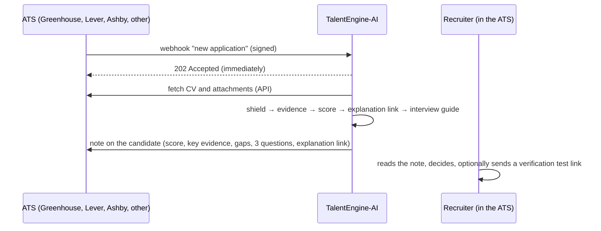

# ATS bridge — TalentEngine-AI as an add-on to your applicant tracking system

Recruiters rarely change ATS. TalentEngine-AI does not ask them to: it plugs into the ATS they already use.



## Set up a connection (admin)

`POST /api/integrations` (or **Settings → ATS integrations** in the app):

| Field | Meaning |
|---|---|
| `provider` | `greenhouse`, `lever`, `ashby` or `generic` |
| `job_mapping` | ATS job id → TalentEngine job profile id. Unmapped jobs are ignored. |
| `secrets` | encrypted with the vault key, never returned (see the table below) |
| `candidate_notice_confirmed` | **required**: your job ads' privacy notice mentions TalentEngine-AI (AI Act Art. 26(11); Code du travail L1221-8). Applications from an ATS are processed under *your* candidate information. |
| `write_notes` | write the result back as a note (default true) |
| `explanation_link_days` | validity of the candidate explanation link included in the note |

Then paste the webhook URL `https://<your host>/api/integrations/<connection id>/webhook` in the ATS.

## Providers

| Provider | Credentials | Webhook verification | Reads | Writes |
|---|---|---|---|---|
| **Greenhouse** (Harvest API v3, OAuth2 client credentials; v1/v2 were scheduled for removal on 31 Aug 2026) | `webhook_secret`, `client_id`, `client_secret`, optional `user_id` (token `sub`) | header `Signature: sha256 <hex>` = HMAC-SHA256(secret, raw body) | `GET /v3/attachments?application_ids=…` (URLs expire after 7 days) | `POST /v3/notes` — **verify the body fields** against Greenhouse's write-endpoint migration guide |
| **Lever** (API v1, Basic auth with the API key) | `webhook_secret` (signature token), `api_key`, optional `perform_as` | HMAC-SHA256(signature token, `token` + `triggeredAt`) equals the body `signature` | `GET /opportunities/{id}`, `/files`, `/files/{file}/download` | `POST /opportunities/{id}/notes` `{"value": …}` |
| **Ashby** (RPC POST API, Basic auth with the API key) | `webhook_secret`, `api_key` | header `Ashby-Signature: sha256=<hex>` | `candidate.info`, `file.info` (resume handle) | `candidate.createNote` — **verify the field names** |
| **Generic** (any ATS, HRIS or script) | a `webhook_secret` generated for you (shown once) | header `X-TalentEngine-Signature: sha256=<hex>` | documents inline (base64) or by URL | result POSTed to `callback_url`, signed the same way |

Teamtailor and SmartRecruiters expose public candidate APIs and can be added the same way; Workday is
tenant-specific (Recruiting web services) and is best connected through the generic contract.

### Generic contract

```http
POST /api/integrations/CONN-1A2B3C4D/webhook
X-TalentEngine-Signature: sha256=5f2c…
Content-Type: application/json

{"application_id": "A-123", "candidate_id": "C-9", "job_id": "REQ-42", "name": "Jane Doe", "email": "jane@…",
 "github_urls": ["https://github.com/janedoe"],
 "documents": [{"name": "cv.pdf", "kind": "cv", "content_base64": "JVBERi0…"},
               {"name": "linkedin.pdf", "kind": "linkedin", "url": "https://files.example.com/…"}],
 "callback_url": "https://ats.example.com/hooks/talentengine"}
```

`kind` is one of `cv`, `linkedin`, `degree`, `certification`, `document`.

## Security

* Signatures are checked in constant time before anything is parsed; an invalid signature returns 401.
* Attachments are downloaded through the same SSRF guard as the sandbox (public addresses only,
  re-checked on every redirect, 15 MB cap); callbacks must point to public addresses.
* Secrets are stored encrypted (Fernet, vault key) and never returned by the API.
* Every connection change and processed application is written to the audit ledger (`integration_created`,
  `ats_application`, `ats_error`).
* The note written back contains no identifier beyond what the ATS already has, and points to the
  candidate explanation link (AI Act Art. 86).
